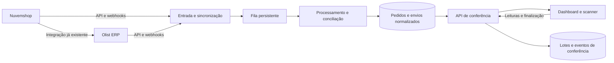

# Revisão do Abelha Par e migração para Nuvemshop + Olist

Revisão em 30/09/2026, sobre o commit `1573a886`. Este documento registra diagnóstico e proposta; não representa uma integração já implementada.

**Atualização:** a implementação posterior e seus requisitos de ativação estão em [Integração Nuvemshop](integracao-nuvemshop.md). As descrições de código neste diagnóstico se referem à versão anterior às mudanças.

O usuário confirmou que a Nuvemshop já envia pedidos automaticamente para a Olist. As etiquetas e os rastreios são gerados atualmente na Olist, com possibilidade de adotar Nuvem Envio futuramente. A proposta preserva esse fluxo comercial e adiciona ao Abelha Par a leitura das duas plataformas, a conciliação dos pedidos e o registro persistente da conferência.

**Recomendação:** manter Next.js e Supabase inicialmente, substituir a dependência de planilha/ID Yampi por vínculos explícitos entre pedidos e mover sincronização e regras de conferência para o servidor. O código atual oferece componentes reaproveitáveis, mas ainda não atende ao fluxo Nuvemshop.

## Funcionamento atual

| Etapa | Implementação | Implicação para a migração |
| --- | --- | --- |
| Entrada na aplicação | Supabase Auth; páginas de login e recuperação | Pode ser reaproveitada; corrigir a descoberta do middleware |
| Conexão ERP | OAuth Tiny v3, tokens cifrados no servidor | Reaproveitar conexão e adaptador; separar credencial da identidade do operador |
| Seleção de pedidos | Busca Olist por criação/atualização; filtro WooCommerce | Pedidos da nova integração são descartados pelo filtro atual |
| Lista de referência | Arquivo Yampi, primeira aba, coluna `numero_pedido` | Substituir por pedidos e estados comerciais da Nuvemshop |
| Conciliação | ID extraído de observações ou `numeroPedidoEcommerce`, armazenado como `yampiId` | Criar identidade própria e referências externas com origem conhecida |
| Preparação | Navegador resolve detalhes em grupos de cinco | Transferir trabalho durável para sincronização no servidor |
| Conferência | Zustand compara rastreios, mostra sucesso/erro e atualiza contagem | Reaproveitar interação; persistir sessão e leituras |
| Rastreio tardio | Consulta pedidos pendentes sem código, com repetição e cancelamento | Reaproveitar comportamento, usando pedidos/envios normalizados |
| Finalização | Clique em “Salvar Lote” envia todo o estado do navegador | Criar finalização transacional e idempotente |
| Histórico | Últimos 50 lotes; pedidos em JSONB; impressão | Preservar lotes antigos; paginar e consultar itens individualmente |

Não existe chamada à API da Yampi ou ao WordPress no fluxo revisado. O acoplamento está na planilha, nos identificadores e no filtro de canal. A situação do pedido é carregada, mas não participa da regra de elegibilidade da bipagem.

## Achados que afetam operação e migração

As prioridades abaixo expressam impacto operacional. São achados de código e verificações locais; não comprovam que cada cenário já ocorreu em produção.

### 1. Alta — pedidos Nuvemshop são excluídos

`src/lib/olist.ts:114` filtra a listagem por `isWooCommerceOrder`. A função, na linha 155, aceita o ID configurado em `OLIST_WOOCOMMERCE_ECOMMERCE_ID` ou o nome WooCommerce. O valor padrão é `20161`.

Uma resposta sintética contendo um pedido WooCommerce e um Nuvemshop devolveu somente o primeiro. Alterar apenas textos da interface não resolve: filtro, normalização, tipos, conciliação e histórico precisam reconhecer a origem correta. O novo filtro deve usar o ID real da integração Nuvemshop no ERP, associado à loja, sem depender apenas do nome do canal.

### 2. Alta — vínculo de identidade e liberação comercial são insuficientes

`src/lib/matcher.ts` considera apenas a presença do `yampiId` na lista; não avalia `situacao`, duplicidade da referência ou correspondência única. `src/lib/regex.ts` também aceita um número genérico precedido de `#` como fallback.

Consequências: uma referência ambígua pode entrar na sessão; uma mudança de situação não impede a conferência. A reprodução local confirmou que alterar `situacao` não altera o resultado do cruzamento. Na nova arquitetura, vínculo e elegibilidade precisam ser decisões independentes, verificadas no servidor.

### 3. Alta — formato documentado de webhook Olist não é reconhecido

`src/lib/olist-webhook.ts:37` procura `idPedido`, `id`, `pedido.id` e `data.id`. O webhook de vendas documentado para a extensão de webhooks do ERP coloca o pedido em `dados.id`. A reprodução com esse formato retornou `null`; a rota registra recebimento e responde 200 sem enfileirar o pedido. [Documentação oficial desse webhook](https://tiny.com.br/api-docs/api2-webhooks-tiny).

A documentação citada pertence aos webhooks do ERP publicados na seção API 2.0. É preciso capturar o formato efetivamente configurado na conta antes de concluir que todos os eventos de produção são afetados. A leitura dos detalhes pode continuar pela API v3.

### 4. Alta — recuperação periódica deixa lacunas

`vercel.json` agenda `0 3 * * *`, uma execução diária. `src/lib/olist-sync.ts:228` consulta somente o dia atual de São Paulo; o último checkpoint serve apenas para evitar consultas próximas, não para recuperar o intervalo perdido. Na Vercel o cron usa UTC: o horário configurado corresponde à meia-noite de São Paulo na data desta revisão. Portanto, eventos perdidos durante o dia anterior podem ficar fora da descoberta seguinte. [Fuso do cron](https://vercel.com/docs/cron-jobs).

Além disso, `discoverUpdatedOrders` chama `enqueueOlistOrders` com `refreshExisting=false`. O `ignoreDuplicates: true` da linha 137 impede que um pedido já concluído na fila seja reativado por descoberta posterior. O cron processa dez itens por chamada ao consumidor, com uma segunda chamada condicional; não esgota uma fila grande.

Usar checkpoint persistente, janela de sobreposição, reprocessamento de mudanças e consumidor com capacidade compatível com o volume real.

### 5. Alta — fila pode travar ou perder uma atualização concorrente

`supabase/migration_v4_incremental_olist_sync.sql` reserva itens com `SKIP LOCKED`, uma boa base. Porém, só seleciona `queued` e `failed`; não recupera um item que ficou `processing` após interrupção. `locked_at` não funciona como prazo de reserva.

O webhook também faz `upsert` que redefine o estado do mesmo pedido e o processa imediatamente, fora da reserva da fila. Um consumidor antigo pode marcar como concluída uma atualização recém-enfileirada. Proposta: reserva com expiração, versão da solicitação e conclusão condicionada à reserva/versão processada.

### 6. Alta — progresso da conferência não é durável

`src/stores/scan-store.ts:28` mantém a sessão apenas em memória. Recarregar a página perde os pedidos e as leituras. `src/components/scanner/completion.tsx:122` permite iniciar outro lote e apagar o estado sem exigir que o anterior tenha sido salvo.

Persistir o lote ao iniciar, registrar cada leitura aceita e permitir retomada. O estado do navegador pode continuar oferecendo resposta rápida, com indicação explícita de gravações pendentes ou falhas.

### 7. Alta — finalização não é idempotente e aceita estado declarado pelo cliente

`src/app/api/batches/route.ts:28` insere um novo registro a cada POST. Se o banco salvar e a resposta se perder, repetir o envio cria outro lote. `sanitizeOrders` verifica formato e `status: checked`, mas não confirma existência, pertencimento ao lote, duplicidades ou leituras persistidas; aceita ausência de horário de leitura.

`processBarcode`, em `src/stores/scan-store.ts:69`, procura primeiro um pedido pendente com o mesmo rastreio. A reprodução confirmou que duas leituras da mesma etiqueta podem concluir dois pedidos distintos que compartilhem esse código.

Criar identificadores de lote/leitura, restrições de unicidade e transações. Etiqueta com múltiplas correspondências deve gerar uma divergência ou seguir uma regra explícita de agrupamento, em vez de consumir silenciosamente o próximo pedido.

### 8. Média — cache com rastreio preenchido não expira

`src/lib/olist-sync.ts:75` só atualiza automaticamente entradas ausentes ou sem código. Não avalia a idade de `resolved_at`. Sem webhook efetivo, um código substituído, ID corrigido ou situação alterada pode permanecer antigo mesmo depois de “Buscar novamente”. O dashboard usa `forceRefresh=false`.

Definir validade por campo/estado, invalidar por atualização da origem e conferir frescor ao liberar/finalizar o lote. Uma etiqueta já conferida deve manter seu registro histórico, mesmo que a origem mude depois.

### 9. Média — limites de API são controlados somente por processo

`src/lib/rate-limit.ts` usa um `Map` em memória. `src/lib/olist.ts` usa um relógio local para espaçar detalhes em 1,1 segundo; listagens e verificações da conexão não compartilham esse orçamento. Instâncias distintas, navegador e consumidor podem competir pela mesma conta.

A Olist documenta limites por conta, compartilhados entre aplicativos, e planos com 30 leituras/minuto; aproximadamente 54 detalhes/minuto já excederiam esse patamar. Usar limite configurável por conta, respeitando respostas do provedor e repetição com espera progressiva. [Limites oficiais da API v3](https://ajuda.olist.com/hubs-e-plataformas-via-api/aplicativos-api-v3-configuracoes-e-utilizacao).

### 10. Média — middleware não aparece no build

O build desta revisão produziu `middleware: {}` e `sortedMiddleware: []` em `.next/server/middleware-manifest.json`. A aplicação está em `src/app`, mas o arquivo está em `/middleware.ts`. O código do Next instalado procura os arquivos de entrada no diretório pai de `app`, neste caso `src`.

Mover a entrada para `src/middleware.ts` e verificar o manifesto e os redirecionamentos. As APIs revisadas possuem verificações próprias; este achado não significa acesso anônimo automático ao banco. A renovação e a navegação previstas no middleware, entretanto, não estão sendo executadas por esse build.

### 11. Modelagem — usuário, loja e responsável são conceitos distintos

Integração, cache, fila e lotes são vinculados a `owner_id = auth.uid()`. Cada usuário vê seus próprios lotes e possui sua própria conexão. `responsavel` é texto livre; não representa necessariamente a conta autenticada.

Para operadores da mesma loja compartilharem a operação, criar uma entidade de operação/loja e suas permissões. Guardar separadamente quem iniciou, quem leu e quem finalizou. Isso exige migrar RLS e vínculos existentes de forma explícita; não basta trocar a coluna nas consultas.

## Arquitetura proposta

Next.js pode continuar servindo a interface e a API. Supabase/Postgres pode guardar tanto os dados operacionais quanto a fila. O processamento precisa ter execução independente do navegador e um agendamento que cubra a operação; o cron diário atual não fornece isso. A escolha de hospedar o consumidor junto da aplicação ou em um processo separado depende do volume e da infraestrutura disponível.

| Informação | Fonte proposta |
| --- | --- |
| Identidade da venda e pagamento | Nuvemshop |
| Identidade do pedido no ERP e situação operacional | Olist |
| Rastreio utilizado hoje | Olist |
| Rastreio futuro | Adaptador da origem responsável pelo envio, com procedência registrada |
| Vínculo entre plataformas e divergências | Abelha Par |
| Lote, leitura, operador e conclusão | Abelha Par |

A integração nativa Olist–Nuvemshop já oferece recepção de pedidos e sincronização de rastreio/situações. Deve continuar responsável pelas automações comerciais atualmente configuradas. [Recursos e configuração da integração](https://ajuda.olist.com/pt_BR/plataformas-de-e-commerce/nuvemshop-configuracoes).

**Bipado não deve ser sinônimo automático de enviado.** A Olist documenta que o envio de rastreio para a Nuvemshop pode marcar o pedido como enviado. Por isso, o status de envio da plataforma não basta para determinar se houve conferência física. Precisamos registrar essa conferência no Abelha Par e observar em qual etapa a operação transmite o rastreio. [Comportamento da integração](https://ajuda.olist.com/plataformas-de-e-commerce/nuvemshop-utilizacao).

## Vínculo entre os pedidos

A Nuvemshop distingue `id`, `number` e `store_id`. Também expõe situação de pagamento e filtros por atualização, úteis para substituir a planilha e recuperar mudanças. [Recurso Order](https://tiendanube.github.io/api-documentation/resources/order).

Guardar, no mínimo:

| Referência | Uso |
| --- | --- |
| ID interno do Abelha Par | Identidade estável, independente do provedor |
| Operação e loja Nuvemshop | Escopo de acesso e de numeração |
| ID Nuvemshop | Consulta à API e associação a eventos |
| Número Nuvemshop | Exibição e candidato ao vínculo com ERP |
| Conta Olist e ID do pedido Olist | Consulta e eventos do ERP |
| ID da integração de e-commerce na Olist | Distinguir canais e lojas |
| Referência externa recebida da Olist | Evidência do vínculo |
| Método e situação do vínculo | Automático confirmado, pendente ou divergente |

O código atual conhece `ecommerce.numeroPedidoEcommerce` e declara `numeroPedidoCanalVenda`. **Ainda não está verificado qual campo contém qual referência da Nuvemshop na conta do usuário.** A documentação dinâmica do Swagger v3 não foi extraída nesta revisão; não se deve tratar uma correspondência presumida como contrato confirmado.

Validar uma amostra de pedidos nas duas APIs: recém-criado, pago depois da criação, cancelado e com etiqueta. Comparar as referências estruturadas dentro da mesma conta/loja; depois salvar o vínculo explícito. Nome, e-mail, data ou valor podem apoiar investigação, mas não devem decidir o vínculo automaticamente.

A unidade de bipagem também merece identidade própria. A Nuvemshop possui `Fulfillment Order` para múltiplos envios de uma venda e permissões específicas para sua leitura. Isso justifica modelar envios separadamente, mesmo que a operação comece com uma etiqueta por pedido. [Fulfillment Order](https://tiendanube.github.io/api-documentation/resources/fulfillment-order).

## Sincronização e estados operacionais

O aplicativo Nuvemshop precisa de autorização própria da loja; a instalação da integração Olist não concede automaticamente acesso ao Abelha Par. O OAuth fornece token e identificação da loja. Começar com permissões de leitura necessárias ao fluxo; não presumir o mesmo ciclo de renovação usado pela Tiny. [Autenticação Nuvemshop](https://nuvemshop.dev/en-US/api-docs/authentication).

A API documenta base versionada e identificação da aplicação via `User-Agent`. O adaptador deve fixar a versão validada, paginar respostas e tratar os limites da Nuvemshop separadamente dos da Olist. [Introdução da API](https://tiendanube.github.io/api-documentation/intro).

Na Nuvemshop, considerar eventos de criação, atualização, pagamento e cancelamento; acrescentar eventos de envio conforme o uso. Validar HMAC sobre o corpo recebido. O provedor espera resposta em até três segundos e admite repetição e desordem de notificações: registrar duravelmente, responder e processar depois. [Webhooks Nuvemshop](https://tiendanube.github.io/api-documentation/resources/webhook).

Regras propostas para o processamento:

1. Receber o evento e validar origem/loja.
2. Registrar o recebimento e solicitar uma sincronização durável.
3. Consultar a versão atual do recurso; não retroceder estado com evento antigo.
4. Normalizar somente os dados necessários à operação.
5. Conciliar referências; manter divergências visíveis.
6. Atualizar elegibilidade e avisar sessões abertas de mudanças relevantes.
7. Recuperar eventos perdidos por checkpoint e janela de sobreposição.

Coalescer notificações do mesmo pedido exige uma versão de solicitação: se chegar uma mudança durante o processamento, outra consulta precisa permanecer pendente. Um hash permanente do corpo não serve sozinho para deduplicação, porque notificações de mudanças distintas podem carregar os mesmos identificadores.

Estados sugeridos para o dashboard: aguardando pagamento, aguardando ERP, aguardando rastreio, divergência, apto para conferência, em conferência e conferido. Pagamento, situação no ERP, envio e conferência continuam campos distintos. Cancelamento, estorno e mudanças de etiqueta devem produzir bloqueio ou revisão explícita conforme a regra operacional validada.

**Nuvem Envio futuro:** a origem do rastreio será configurável. A Olist informa que pode importar rastreio já existente na loja, mas isso não comprova o campo nem o momento em que ele aparecerá para este fluxo. Validar um pedido real quando essa modalidade entrar; manter leitura direta dos envios Nuvemshop como possibilidade. [Importação de rastreio na integração](https://ajuda.olist.com/plataformas-de-e-commerce/nuvemshop-utilizacao).

## Dados e módulos a introduzir

Esboço de responsabilidades, ainda sem DDL definitivo:

| Entidade/módulo | Responsabilidade |
| --- | --- |
| Operação e membros | Compartilhamento da loja e permissões dos operadores |
| Integrações | Provedor, conta/loja externa, credencial cifrada e saúde da conexão |
| Pedidos | Identidade interna e dados comerciais normalizados |
| Referências externas | Vínculos entre pedido interno e identidades dos provedores |
| Envios | Pedido, referência externa, origem, transportadora e rastreio |
| Lotes e itens | Sessão retomável, itens reservados e versão dos dados conferidos |
| Eventos de leitura | Código recebido, resultado, operador, horário do servidor e chave idempotente |
| Fila e checkpoints | Repetição, reserva com prazo, erros e cobertura da sincronização |

Separar adaptadores Olist/Nuvemshop, normalização, conciliação, elegibilidade, conferência e persistência. As rotas devem chamar esses serviços; os componentes devem apresentar o resultado. Isso permite manter o scanner e substituir gradualmente a aquisição de dados.

## Sequência de migração

1. **Confirmar contrato real.** Consultar amostra nas duas plataformas; identificar loja, conta e integração Olist; confirmar referência de vínculo, estados comerciais e rastreio. Entrega: fixtures sem dados pessoais e tabela de mapeamento validada.
2. **Conectar Nuvemshop em modo de leitura.** Criar autorização, ingestão paginada e sincronização independente. Entrega: listagem comparável ao painel da loja, sem depender da planilha.
3. **Criar conciliação no servidor.** Introduzir pedidos, referências e envios; trocar o filtro WooCommerce pelo canal configurado. Entrega: correspondências e pendências explicadas, sem associação ambígua silenciosa.
4. **Persistir conferência.** Criar lote antes das leituras, retomar sessão, impedir concorrência indevida e finalizar de forma idempotente. Entrega: recarregar ou repetir requisição não perde nem duplica trabalho.
5. **Operar um piloto.** Comparar candidatos com a operação real, reconciliar cancelamentos/pagamentos tardios e medir atraso/fila/consumo de API. Usar chave de configuração para selecionar o fluxo habilitado.
6. **Concluir a transição.** Tornar o fluxo Nuvemshop padrão, retirar upload Yampi dos novos lotes e manter leitura/impressão dos históricos antigos. Retirar componentes e dependências sem uso depois da validação.

As mudanças de banco devem ser aditivas primeiro. Lotes históricos em JSONB mantêm seus identificadores Yampi; não reinterpretá-los como Nuvemshop. Registros antigos sem `owner_id`, ocultados pela migração v3, precisam de levantamento e atribuição explícita antes de uma migração de permissões. Preservar também a chave de criptografia dos tokens: o código atual remove integrações quando falha ao decifrá-las.

A migração v5 aberta no editor é compatível com manter o histórico: adiciona `responsavel`, preenche registros existentes com “Não informado”, exige 3–100 caracteres e remove o valor padrão para novas inserções. Ela não resolve identidade de operador nem vínculo entre plataformas. O novo modelo deve preservar o texto histórico e acrescentar IDs dos atores autenticados.

Critérios de aceitação da nova operação:

- Pedido pago após o dia da criação entra pela atualização.
- Pedido cancelado ou sem vínculo confirmado não é liberado silenciosamente.
- Atraso entre Nuvemshop e ERP aparece como pendência recuperável.
- Código ausente pode chegar depois sem apagar leituras existentes.
- Rastreio substituído e etiqueta ambígua geram tratamento explícito.
- Dois operadores não concluem indevidamente o mesmo envio.
- Recarregar a página recupera lote e leituras confirmadas.
- Repetir leitura/finalização/evento não duplica o efeito.
- Falha de consumidor e evento perdido são recuperáveis.
- Histórico antigo continua legível e imprimível.

## Validação realizada e limites

- `npm test`: seis testes aprovados, concentrados em rastreio tardio, estado do scanner e validação de lote.
- TypeScript: `tsc --noEmit --incremental false` aprovado.
- `npm run build`: aprovado com Next.js instalado 15.5.22. Houve aviso de bloqueio do SWC nativo pela política do Windows; o build concluiu usando a alternativa WASM.
- Verificações adicionais com módulos reais e dados sintéticos confirmaram: exclusão de Nuvemshop, rejeição do formato `dados.id`, ausência de filtro de situação, dupla conferência com mesmo rastreio e aceitação de pedido declarado conferido sem horário de leitura.
- O manifesto do build confirmou ausência de middleware.
- Não foram executados testes com contas reais, scanner físico, banco remoto ou notificações de produção. Não foi verificado quais migrações estão aplicadas no Supabase remoto.
- A revisão não modificou código funcional nem aplicou SQL. Os arquivos rastreados de `.next` alterados pelo build foram restaurados ao estado inicial.

Outros pontos para o trabalho de manutenção: 125 arquivos de `.next` estão rastreados apesar do `.gitignore`; o histórico tem limite fixo de 50 lotes sem paginação; o tipo `Batch.pedidos` declara `ScanOrder[]`, mas a gravação remove campos desse tipo; impressão está duplicada em dois componentes; a data operacional do lote é gravada em UTC enquanto a busca diária usa São Paulo. Esses pontos devem entrar no planejamento, sem desviar da validação do vínculo Nuvemshop–Olist.
